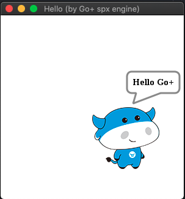

## 坐标
Spx中舞台(stage)的坐标系为直角坐标系  （Rectangular Coordinates），其舞台原点(stage origin)为（0，0）为直角坐标系的原点（origin）     


## 精灵(sprite)
可以理解为一个在舞台中演出的角色，每个精灵都可以编写其配置信息决定其表现，以及通过编写`spx` 代码控制其行为逻辑

下图即为一个精灵(sprite)在舞台(stage)上展示的效果，其配置信息决定了精灵的显示效果

  
```json
{
  "costumes": [
    {
      "name": "calf-0",
      "path": "1.png",
      "x": 55,
      "y": 50
    }
  ],
  "costumeIndex": 0,
  "heading": 90,
  "isDraggable": false,
  "rotationStyle": "normal",
  "size": 1,
  "visible": true,
  "x": 0,
  "y": 0
}
```

在接下来的内容中，将会对以上配置信息一一进行介绍

### 精灵坐标系（sprite-coordinate)
以精灵左上角作为坐标原点，水平线设为x轴，垂直线设为y轴，定义向右向下为x、y轴的正方向，反之为负，在造型(costume)中的配置也为参考该精灵坐标系，即使精灵的位置坐标(sprite position)更改，其内部坐标系也不会更改


### 定位原点/位置坐标 (sprite position)
* 精灵的定位原点（sprite origin）在它的左上角
* 一个精灵将围绕着它的原点进行旋转
* 配置信息中的`x`与`y` 配置了该精灵的中心点离定位原点(origin)的向x轴和y轴的偏移距离

我将展示几个例子方便理解配置，在以下例子中，我们不设置造型(costume)的造型中心点，均默认为0（后续内容会介绍），且配置heading为90
```json
{
  "costumes": [
    {
      "name": "calf-0",
      "path": "1.png",
      "x": 0,
      "y": 0
    }
  ],
  "costumeIndex": 0,
  "heading": 90,
  "isDraggable": false,
  "rotationStyle": "normal",
  "size": 1,
  "visible": true,
  "x": 0,
  "y": 0
}
```



该例子中，小牛的配置信息为`x:0` `y:0`，且因为精灵的定位原点`(sprite origin）`在精灵的左上角,所以小牛出现在了坐标轴的第四象限的位置。

而我们继续配置其`x`为`50` `y`为`50`，则小牛会沿着x轴和y轴各位移50个单位，其值为负，则会沿着x轴和y轴的反方向移动,这里不过多演示


### 朝向(heading)
heading参数决定了精灵的朝向，其值为角度，默认角度为0，允许输入范围为`0 ～ +- 180`

在该角度系统中，我们以一个平面直角坐标系来理解，水平的为X轴，向右为正向左为负，垂直的为Y轴向上为正，向下为负。而在该角度系统中，`0` 为 y轴正方向，`90` 为 x轴正方向，`+-180`为 y轴负方向，`-90` 为 x轴负方向；

从y轴正方向顺时针旋转到y轴负方向，则为从 `0`依次增大到 `+180`  
从y轴正方向逆时针旋转到y轴负方向，则为从 `0`依次减小到 `-180`


在精灵的配置中，默认 `heading` 为 `0`,则默认为在舞台的平面直角坐标系中，朝向为垂直朝上，并且因为其定位原点（sprite origin）在该精灵的左上角，所以小牛即在舞台的第一象限展示


而且当我们修改小牛的heading时，也会绕着其定位原点（sprite origin）原点旋转，当heading为90时，小牛朝向为水平向右，将展示在舞台的第四象限


## 造型(costume)
造型可以理解为精灵的一组造型图片，可以在对应的精灵配置文件中的`costumes`进行配置。


### 造型坐标 (costume position)
造型原点(costume origin)的初始位置为精灵的定位原点
精灵在配置造型原点(costume origin)时的`x` `y`值时也就是在配置 造型原点 离 定位原点(sprite origin) 的在精灵坐标系（sprite-coordinate）中的偏移量，


以下展示的为配置精灵的heading为90时的效果，`costume position`中配置的`(x:0,y:0)`则表示造型(costume)的中心点离精灵(sprite)的中心点的偏移量，所以在该精灵的配置为0,0的时候，精灵渲染在右下角
```javascript
{
  "costumes": [
    {
      "name": "calf-0",
      "path": "1.png",
      "x": 0,
      "y": 0
    }
  ],
  "costumeIndex": 0,
  "heading": 90,
  "isDraggable": false,
  "rotationStyle": "normal",
  "size": 1,
  "visible": true,
  "x": 0,
  "y": 0
}
```


而在配置了 造型原点(costume origin)为 `x:55`,`y:50` 的情况下,则代表造型原点(costume origin) 在精灵坐标系（sprite-coordinate）中的偏移量 ,也就是说 造型原点(costume origin) 沿着x轴正方向偏移了55个单位，沿着y轴正方向偏移了50个单位，则该造型（costume）因为该设置其造型原点(costume origin)为精灵的中心，且因为该 精灵的定位原点(sprite origin)离舞台原点(stage origin)偏移量，所以小牛展示在了舞台的正中心。

```javascript
{
  "costumes": [
    {
      "name": "calf-0",
      "path": "1.png",
      "x": 55,
      "y": 50
    }
  ],
  "costumeIndex": 0,
  "heading": 90,
  "isDraggable": false,
  "rotationStyle": "normal",
  "size": 1,
  "visible": true,
  "x": 0,
  "y": 0
}
```
