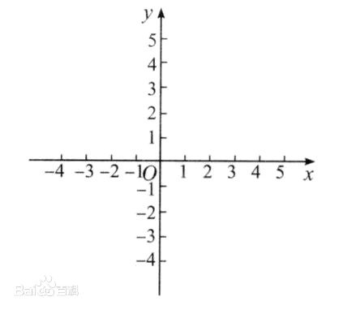
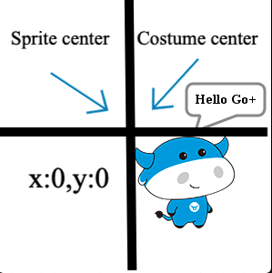
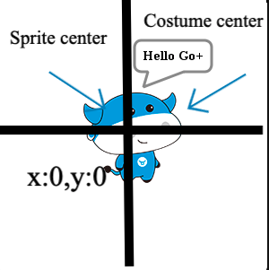

## 场景坐标
Spx中场景的坐标系为直角坐标系  （Rectangular Coordinates），场景的公共原点（0，0）称为直角坐标系的原点（origin）     



## 精灵坐标
### 精灵位置坐标 (sprite position)
精灵原图左上角为精灵的默认中心点位置,配置的x与y的值也就是中心点离原点的x轴y轴的偏移量
### 精灵造型坐标 (costume position)
#### 
精灵在配置`costume` 的位置时，参考的坐标起点则为参考精灵的中心点的位置，

而costume中配置的`x` `y`值可以理解为根据当前精灵的朝向`heading` 向前\向上距离

需要注意的是，costume中配置的x为正值时，costume是向后移动，为负值时，costume是向前移动


以下Demo展示了 精灵坐标为在原点的情况下 heading 为 0 时的 不同costumes坐标配置展示效果,


**或者换种理解方式**   
costume中配置的 x,y 为 cosutume以精灵的中心点作在精灵的x轴y轴上的偏移量

以下展示的为配置精灵的heading为90时的结果，`costume position`中配置的`(x:0,y:0)`则表示造型(costume)的中心点离精灵(sprite)的中心点的偏移量，所以在该精灵的配置为0,0的时候，精灵渲染在右下角
```javascript
{
  "costumes": [
    {
      "name": "calf-0",
      "path": "1.png",
      "x": 0,
      "y": 0
    }
  ],
  "costumeIndex": 0,
  "heading": 90,
  "isDraggable": false,
  "rotationStyle": "normal",
  "size": 1,
  "visible": true,
  "x": 0,
  "y": 0
}
```


而在配置了`costume position`的 `(x:55,y:50)` 的情况下,则代表costume center 离 sprite 的坐标系中的偏移量 ,也就是说 costume center 向右向下偏移了55个像素，50个像素，而渲染该造型时，该点作为中心点，所以造型会渲染在中心

```javascript
{
  "costumes": [
    {
      "name": "calf-0",
      "path": "1.png",
      "x": 55,
      "y": 50
    }
  ],
  "costumeIndex": 0,
  "heading": 90,
  "isDraggable": false,
  "rotationStyle": "normal",
  "size": 1,
  "visible": true,
  "x": 0,
  "y": 0
}
```
