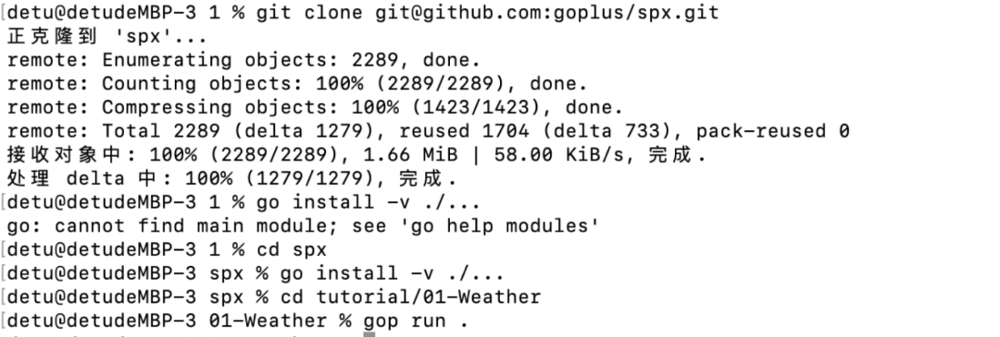
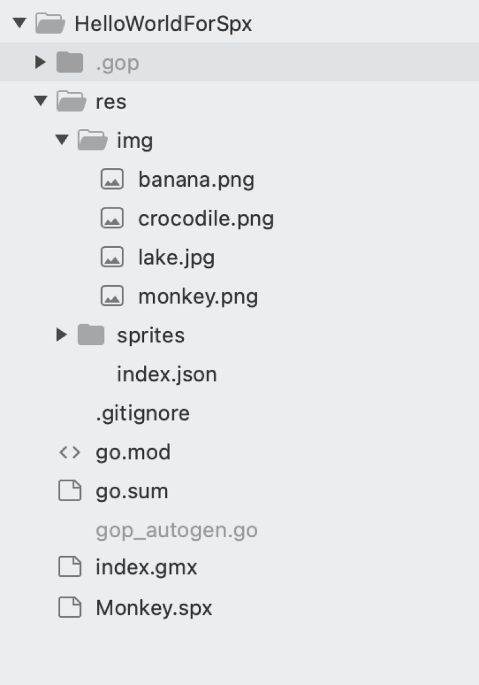

## 一. Spx 介绍
 
### Go+ 和 Spx 
第一点，Go+ 的「三位一体」中有一位是 STEM 教育，Spx 是 Go+ 为 STEM 教育做的 2D 游戏引擎，对标的是 CodeMonkey、Scratch 类的引擎工具。
 
第二点，Go+ 有个很核心的能力——ClassFile，相当于一种行业描述的语言。我们常常说 Go+ 要去通过跨行业沟通，建立跨行业沟通的通用语言，而 STEM 教育正好是一个行业，那么 Go+ 在这个行业中便可借助 ClassFile 进行沟通。
 
第三点是跨平台。Go+ 天生具备跨平台的属性，Spx 在 Go+ 中可以实现跨平台的能力，比如发布在 web 端、手机端、微信小程序等等。这样用户做出的游戏便不再是依赖于某一个引擎来执行，而是相当于做出来一个作品。
 
最终的一句话是：Spx 是 Go+ 在 STEM 教育领域的一个行业描述语言，是一个很经典的 ClassFile 的应用。我们常说 Go+ 最核心的能力是 ClassFile，那我们今天就来讲讲 Spx 是如何与 Go+ 结合在一起，实现 STEM 教育的 DSL。
 
首先第一点，最重要的就是如何使用，如何跑起来。

第一步是到 GitHub 中把文件 down 下来安装。例子中有一个天气，gop run 一下便会出现一个「你来自哪里？」这个步骤相当于拿到一个新东西后如何跑出一个「Hello World」。
 
当我们看到这个例子后，会思考如何用 Spx 去做一个「Hello World」，这也是学习其他语言的第一步。那么在 Spx 中应该如何写？

