本文发布于[得图 CTO 孙其瑞：Go+ STEM 引擎基础以及动画机制](https://mp.weixin.qq.com/s/_0uGn0QZHIt4ZcVuBJaPfw)
## 一. Spx 介绍
 
### Go+ 和 Spx 
第一点，Go+ 的「三位一体」中有一位是 STEM 教育，Spx 是 Go+ 为 STEM 教育做的 2D 游戏引擎，对标的是 CodeMonkey、Scratch 类的引擎工具。
 
第二点，Go+ 有个很核心的能力——ClassFile，相当于一种行业描述的语言。我们常常说 Go+ 要去通过跨行业沟通，建立跨行业沟通的通用语言，而 STEM 教育正好是一个行业，那么 Go+ 在这个行业中便可借助 ClassFile 进行沟通。
 
第三点是跨平台。Go+ 天生具备跨平台的属性，Spx 在 Go+ 中可以实现跨平台的能力，比如发布在 web 端、手机端、微信小程序等等。这样用户做出的游戏便不再是依赖于某一个引擎来执行，而是相当于做出来一个作品。
 
最终的一句话是：Spx 是 Go+ 在 STEM 教育领域的一个行业描述语言，是一个很经典的 ClassFile 的应用。我们常说 Go+ 最核心的能力是 ClassFile，那我们今天就来讲讲 Spx 是如何与 Go+ 结合在一起，实现 STEM 教育的 DSL。
 
首先第一点，最重要的就是如何使用，如何跑起来。

第一步是到 GitHub 中把文件 down 下来安装。例子中有一个天气，gop run 一下便会出现一个「你来自哪里？」这个步骤相当于拿到一个新东西后如何跑出一个「Hello World」。
 
当我们看到这个例子后，会思考如何用 Spx 去做一个「Hello World」，这也是学习其他语言的第一步。那么在 Spx 中应该如何写？

上图便是一个基础的工程。gop run 一下便会出现下图，一个猴子说「Hello World」。
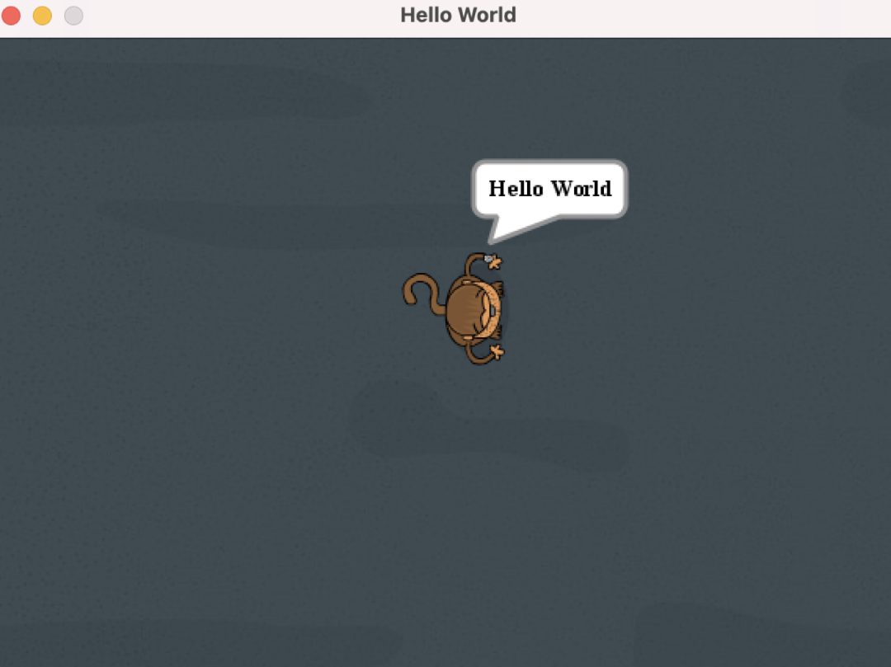

那这个工程中具体有什么？
 
.gmx 是工程文件入口，代表 gop run 的时候从哪里开始读。工程文件其实很简单，首先看下工程文件中有哪些对象，比如「Monkey Monkey」，run 一下后便会出现一个资源包。
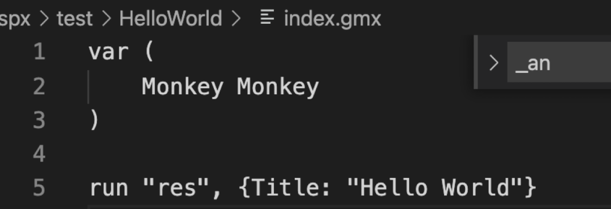
.spx 是精灵对象文件，好比 Scratch 中经常会对某个精灵进行编程，比如下方指令中包含的 onStart，就代表猴子开始启动时说一句「Hello World」；
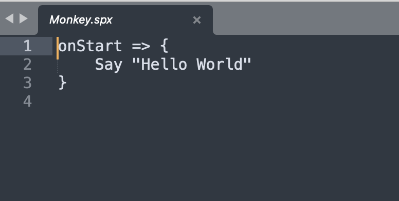
.res 是资源文件，也就是工程的布局。
 
这个「Hello World」的例子已经发布在 GitHub 中（https://github.com/sunqirui1987/HelloWorldForSpx），大家可以下载跑一下。我认为 helloWorld 是认识一个语言和框架最经典的方式。
### Spx 运行机制
刚才我们讲到的运行「Hello World」，其实就是 Go+ Spx 的一段极简代码。一个工程文件就是一个 run，一个精灵文件就是开始时说一句「Hello World」。当我们知道有一个「Hello World」时，应该如何将它跑起来？或者说它在 Spx 中的运行机制是什么？
 
在分析这个问题前，首先要讲一下 Spx 是如何运行的，为什么一个.spx 文件就能跑起来。

这是 ClassFile 中最重要的一个事情 —— 我会把 .spx 和 .gmx 注册在 Go+ 中，这样 Go+ 在 run 的时候便能将这个文件跑起来了。
 
此前老许分享过，程序跑起来后 Go+ 会生成 Go 的代码，我们来看下是如何生成的。
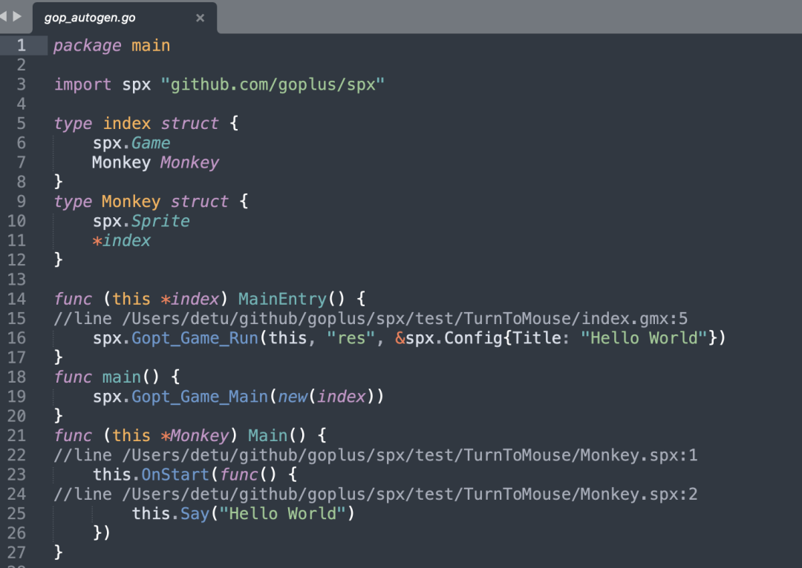
首先大家可以看到，第 19 行 Spx 有一个游戏启动的入口函数，第 16 行对应的是前面我们讲的 run，运行后便会将资源标记信息传进去，进行渲染。当猴子对象产生 Start 方法时，便会说一句「Hello World」。
 
那这种代码是如何真正跑起来的呢？在深入分析前，我们先要了解前面提到的资源文件的构造。以下图这个场景为例：
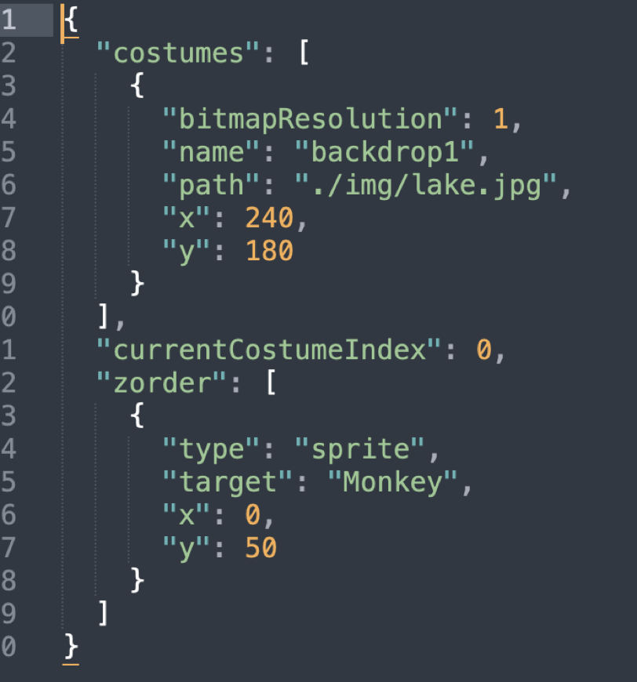
总的来看是一个地图，地图中有一只猴子。我们首先要定义这个场景中包含哪些对象，对象的参数以及对象所在的位置。场景就相当于对这个世界的描述，在世界中有一只猴子，那么这只猴子到底长什么样子，就要看精灵对象文件的配置。如下图所示，该文件中包含图片的属性、是否是序列帧、序列帧朝向、大小等等。
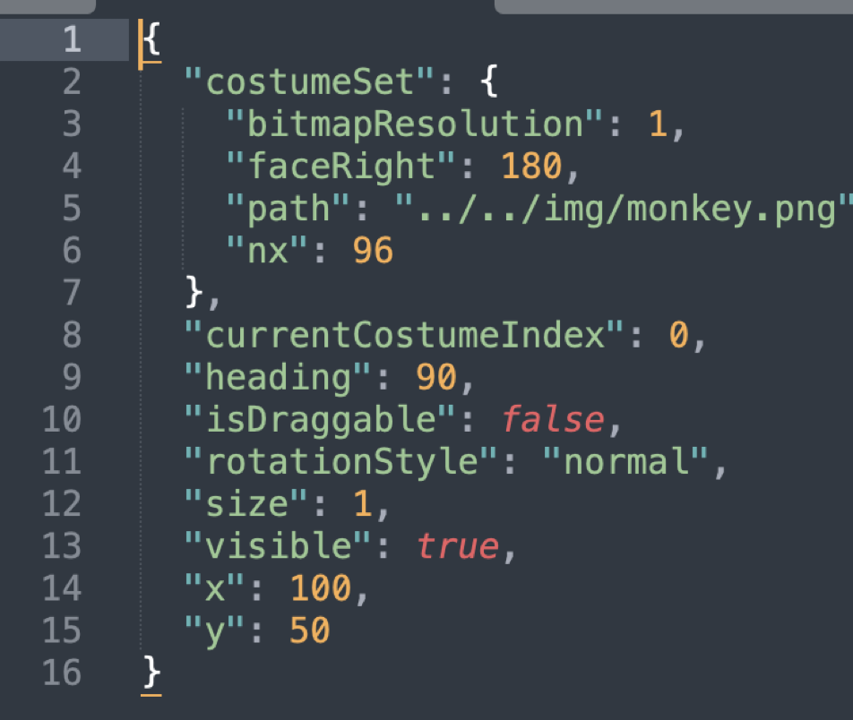
我们相当于通过配置生成了一个世界。当有这个配置文件后，应该如何跑起来？整个精简化的运行时是比较清晰的：
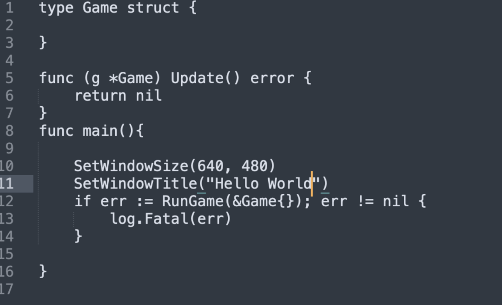

首先是设置一个（640，480）的窗口，给窗口起名为「Hello World」然后便可以运行起来。在第五行不断的进行 update，不断的更新坐标以及一些动画信息。
 
这种精简化的运行时对应到最底层的 openGL 大概会是什么绘制流程？
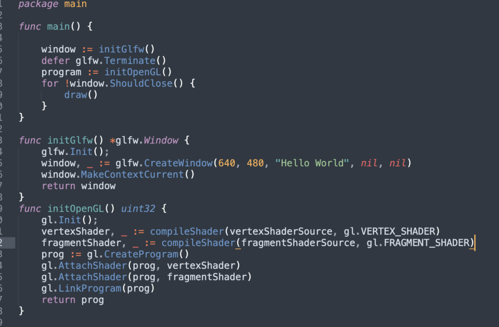
如果大家做过图形渲染或者播放器的工程，对上图中的代码会比较熟悉。首先初始化一个 window，通过 glfw 框架生成（640，480）的「Hello World」，生成一个渲染窗口。然后画一个 openGL 的实例，在这个过程中编译顶点信息和渲染信息，完成图形的绘制。
 
这是一个比较经典的 openGL 的绘制流程，在不同的平台可能会有一些差异。openGL 的渲染是单线程的方式，会通过协程的方式不断切换时间片来运行。我们来看两个 Demo：
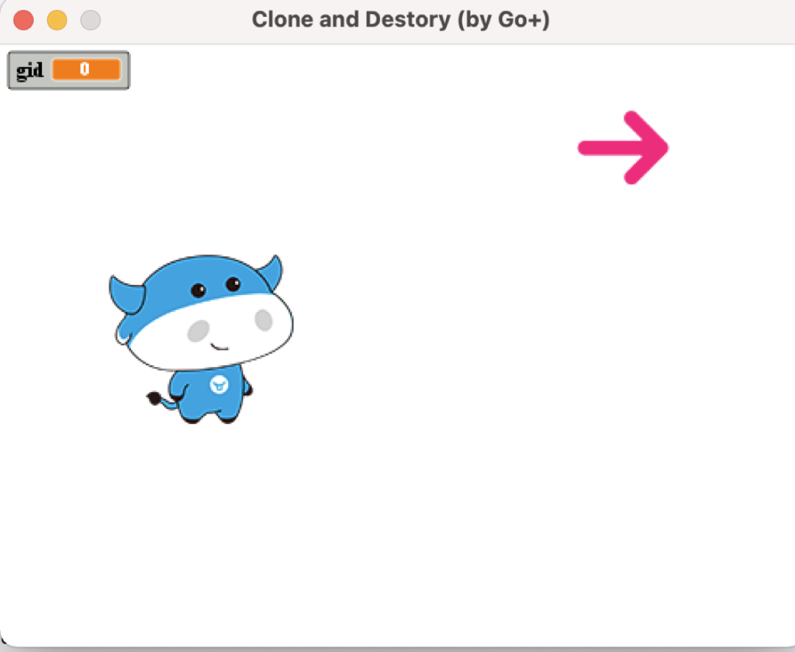
Demo地址：
https://github.com/goplus/spx/tree/main/tutorial/03-Clone

上图中左侧是一只牛，通过点击进行小牛的复制。
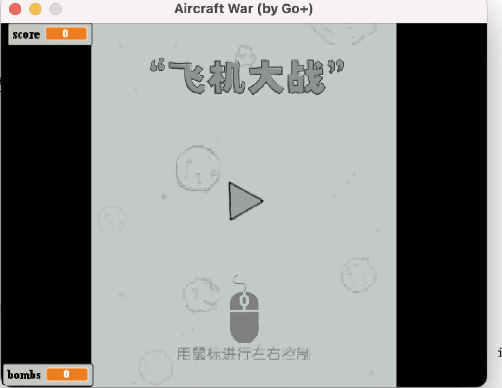
Demo地址：

https://github.com/goplus/spx/tree/main/tutorial/09-AircraftWar

上图是一个小孩子借助 Spx 实现的飞机大战游戏，是工程化比较完整的一个 Demo。
### 动画机制概述
动画机制是 Spx 中的一个很重要模块。因为我们做的是一个 STEM 的游戏引擎，游戏中最重要的便是动画，不能动起来的动画就像图片一样，带给用户的感官会比较差。
 
因此在讲 Spx 的动画前，需要先讲一下动画的机制。在我看来，动画类型无非两种：

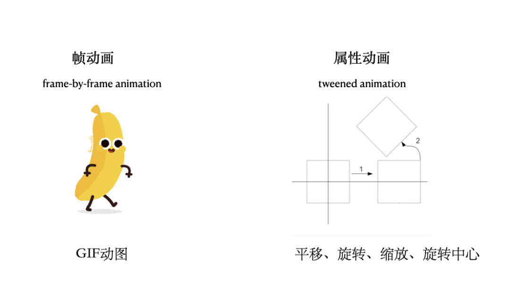
* 帧动画
* 属性动画
其中帧动画也就是本体的动画，无论是哭、笑或者其他移动，都是本体的变化，展现的是从某一帧到某一帧的变化，就像看GIF的感觉。
 
属性动画主要就是平移、旋转、矩阵。比如上图中右侧的例子，正方形先进行向右侧的平移后，进行向上方的旋转。这就是一个属性动画的过程。
 
当存在这两种属性间的变化后，就可以认为这是一个时序动画。所以可以给动画下一个定义：在关键帧与关键帧间创建的时序动画。这个时序可能会穿插一些曲线、补间等等。
 
动画的第二个重点，是它是如何动起来的。我们还是来举个例子。
 
30 FPS 和 60 FPS 的动画给我们的感受区别，就是 60 FPS 的会更流畅一些，因为它快。所以动画的第一个概念，就是播放速度，也就是 30 FPS、60 FPS、120 FPS 的区别。
 
第二个概念是时长。如下图所示，当我们 1 秒钟有 9 FPS 时，帧数会比 1 秒钟只有 6 FPS 的多。因此时长代表我们的动画要播放多久，FPS 代表我们要播放多快。
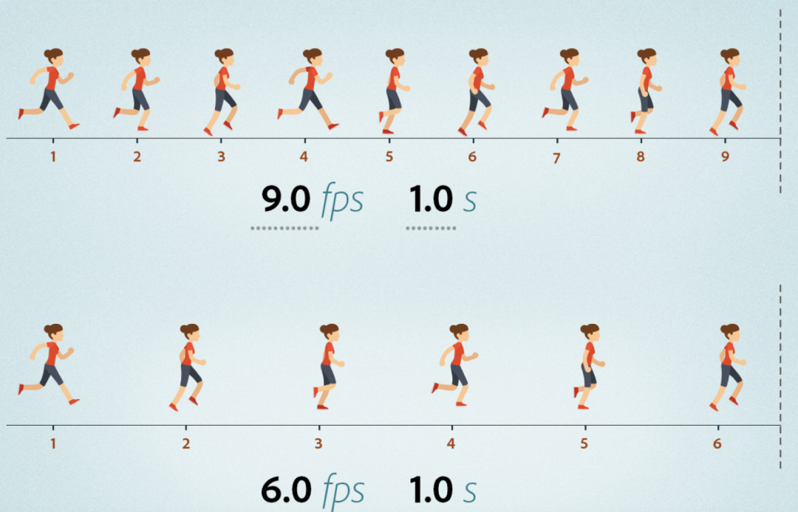
第三个概念是 From To，即我们要从哪里到哪里播放。
 
From To 的意思其实就是关键帧，从哪个关键帧播放到哪个关键帧。比如要从 0° 旋转至 90°，那就是 From 0 To 90。我们再增加其他设定，比如要用 30 FPS 的方式来制作这个动画，持续 2 秒钟，这就是一个动画清楚的描述。
 
第四个概念是动画补间 Tween。
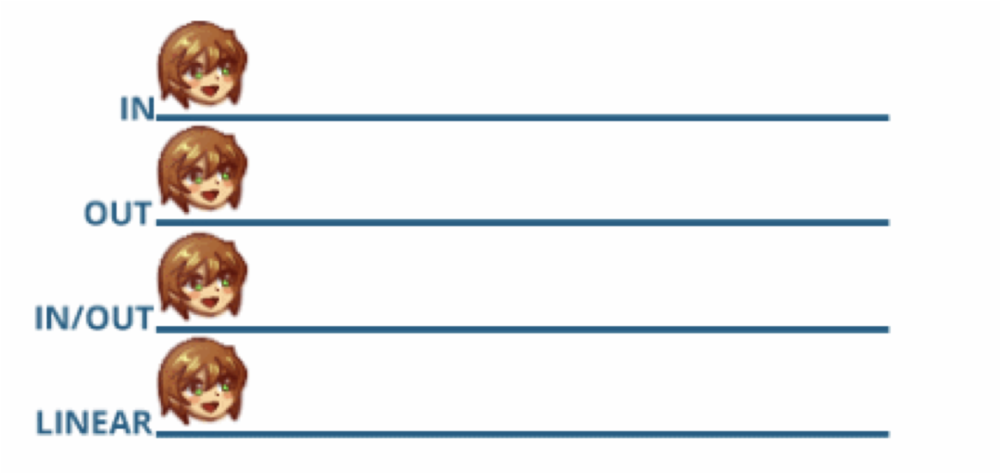
从一个关键帧到另一个关键帧有很多不同的方式，比如先快后慢、先慢后快，或者不断加速、不断减速，这里不同的方式就是动画补间的概念。
 
通过这些概念的叠加，我们就构建出了动画的概念，实现了动画插值。动画插值的意思是当我们给定起始点和终点后，中间的过程可以插值出来，中间的过程就叫做动画插值，反映的是关键帧与关键帧间的补间动画。
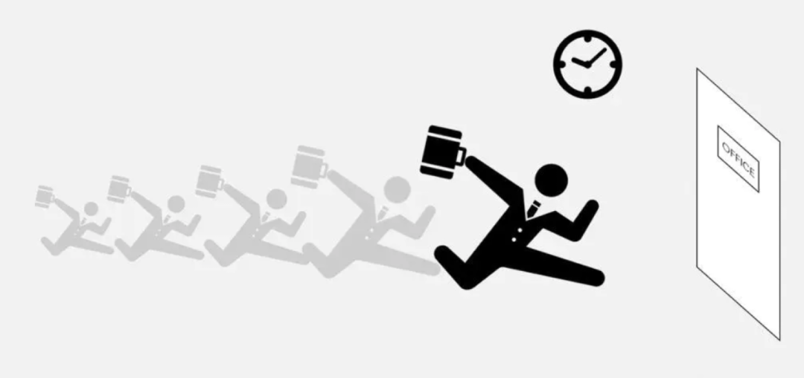
第五个概念是动画事件。动画在过程还有一个事件过程，比如还是从 0° 到 90°，那在这个变换过程中我们要如何实现？是通过旋转还是平移？动画时间反映的便是在过程中做了什么。
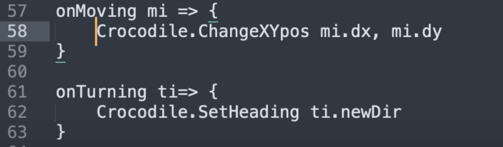
上面的内容基本就是动画的基本概念，这五个概念组成了整个动画的体系。
### Spx 动画机制
下面我们来讲 Spx 如何实现动画。首先我们来给 Spx 的动画类型做下类别的定义：
 
* Frame 动画
* 移动动画
* 旋转动画
 
因为我们是 2D 游戏，所以需要尽可能的让小朋友更容易理解，因此我们直接在配置上便将动画的类型做了拆分。第一类 Frame 动画，也就是帧动画，物体的本体动画；移动动画和旋转动画我们统称为属性动画。下面我们分别来做详细的介绍。
#### 帧动画
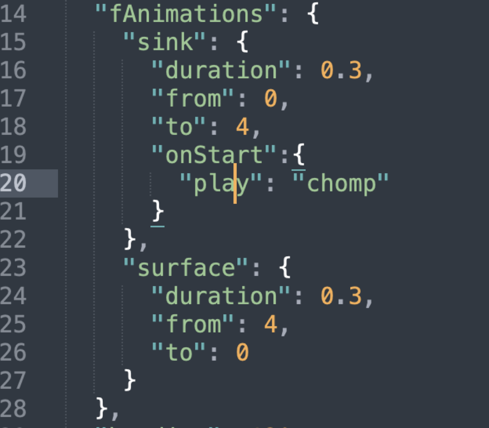
上图是帧动画的配置文件。duration 代表持续的时间，From TO 代表从哪儿到哪儿。但大家可以发现一个问题，为什么没有 FPS、没有动画补间？这是因为 FPS 在加载过程中已经被计算出来了，根据时间与路径便可以计算出包含多少帧。
 
那么具体怎么用呢？
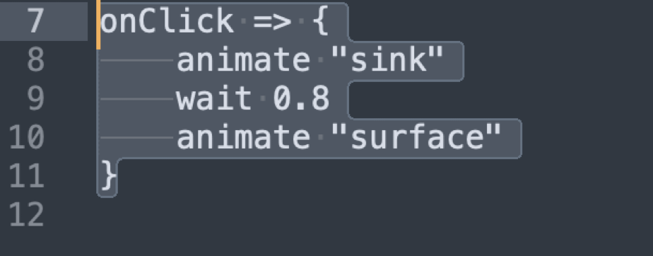
上图中的代码指令是点击播放帧动画，通过一个动画函数直接调用动画，在 0.8 秒后调用第二个动画。
 
整个动画过程在使用过程中很简单，只要配置下行为就可以交给 Spx 引擎去执行。小朋友在编程的过程中，只要播放相应的帧动画，就可以实现人物的哭或者笑。
 #### 移动动画
 我们此前提到过，帧动画是本体的动画，属性动画往往也会和帧动画有关联。比如实现一个人物的行走，人物除了会出现整体的位移，在位移过程中脚也需要有配合的移动，因此便会即涉及到帧动画也涉及到属性动画。
 
所以我们单独定义了一个移动动画的配置选项，比如“step”。
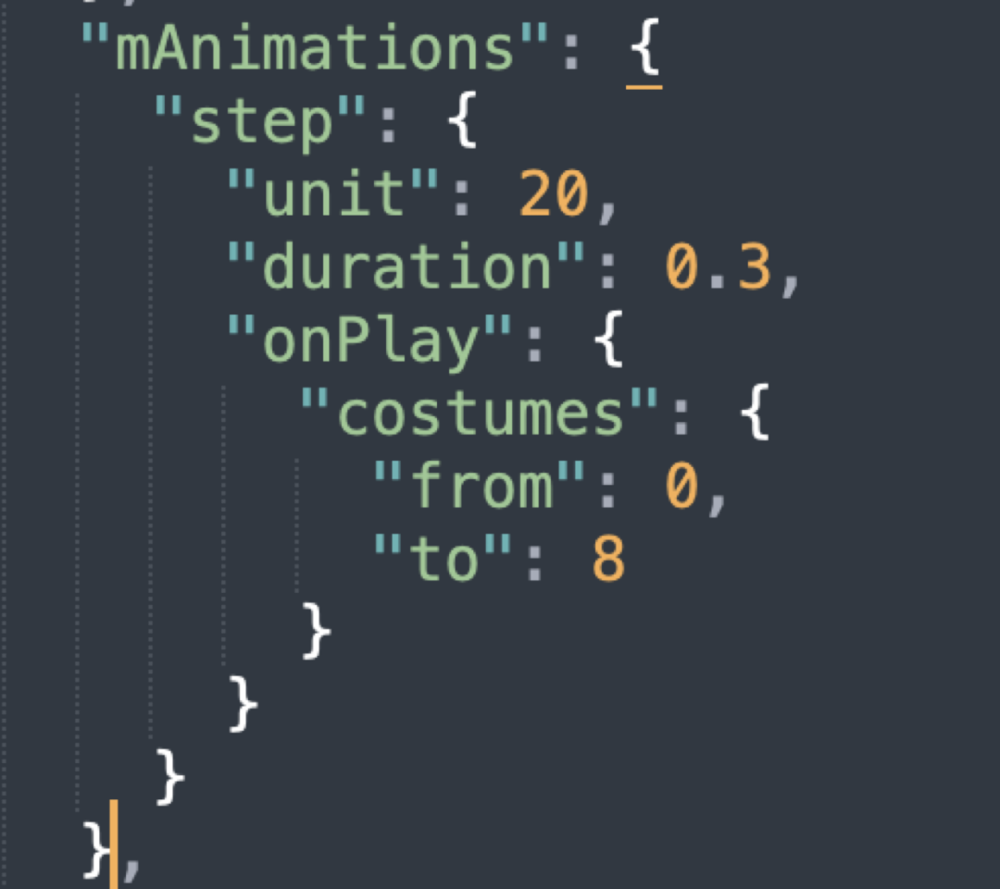
定义之后的第一个概念是行走单位，也就是走一步走多远。现实生活中的度量标准不一样，有像素、厘米、米等等，在 Spx 中的基础度量标准是逻辑单元。在包含一个绘制逻辑的单元，我们可以设置每一步具体是多少个单元。
 
另外还包含每走一步需要多久，上图代码设定的是 0.3 秒。onPlay 是动画播放过程中的事件，从第 0 张图走到第 8 张图，从而模拟出行走的效果。
 
借助这一配置，用户在使用中可以无感的来进行配置开发。只要配置行走动画、配置参数，过程便会变为一个动画。
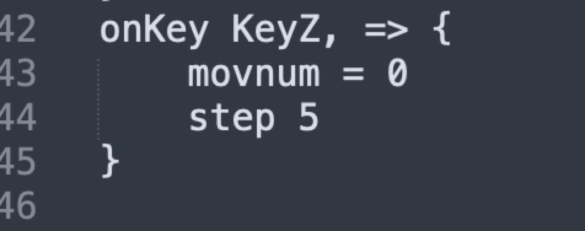

#### 旋转动画
在移动动画中我们举了一个行走的例子，配置包含一步走多远、走多久。而旋转动画中只有如下图所示一个可衡量的配置，也就是时长。这里的时长指的是旋转一周所需花费的时间。
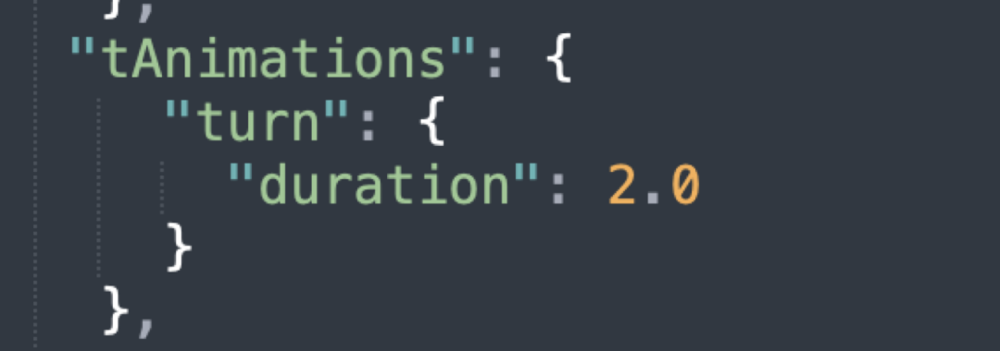
为什么这里只有这么一个简单的配置？因为旋转动画的起始点和终点，和精灵当前的位置有关。移动动画中是以步长为单位来移动，而旋转动画中起始点和重点是在配置旋转代码中就需要实现的。
 
如上图所示从 0° 旋转至 40°，便需要配置 From 0 To 40，20 FPS，根据这些参数来计算时长与播放的帧数。
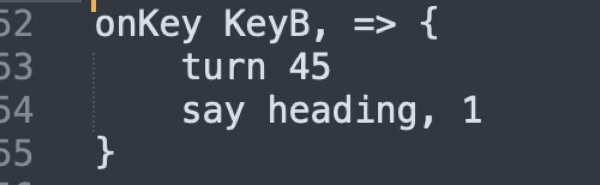
具体的使用也很简单。配置完旋转动画后，只需要调用 turn 45，设定旋转方向即可。底层虽然是异步的方式，但对用户编程来说是同步。
#### 运行原理
我们结合前面三个动画的概述，来看下底层真正的实现。
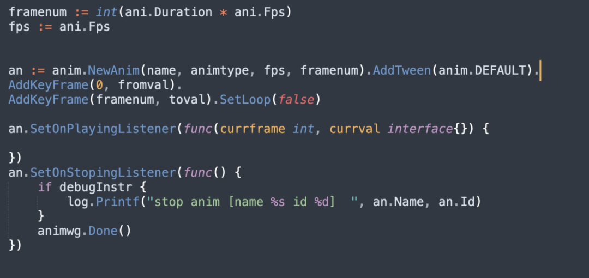
首先第一步是 Duration * ani.Fps。比如有一个 1 秒钟的行走动画，每秒钟要行走 25 帧，那么 FPS 便是 25。其次是给动画起名字，设置动画类型（这里的动画类型指的是插值对象），增加补帧类型（默认值为线性动画）。
 
接下来插入两个关键帧，来计算总共的帧数。设置 From To、设置是否循环播放。经过这几步，我们便创建了一个动画实体。
 
动画实体创建后，我们会设置两个事件，播放事件和停止事件。播放过程中会告知播放到了哪一帧、插值是多少，从而可以设置旋转、平移等动画，在回调中实现动画效果。最后便是停止。
 
我们可以把动画的概念类比为一个视频，有播放有停止，有时长、速度、变速等等。
 
下面我们来看当创建动画对象后，在 Spx 的渲染机制中应该如何调用。
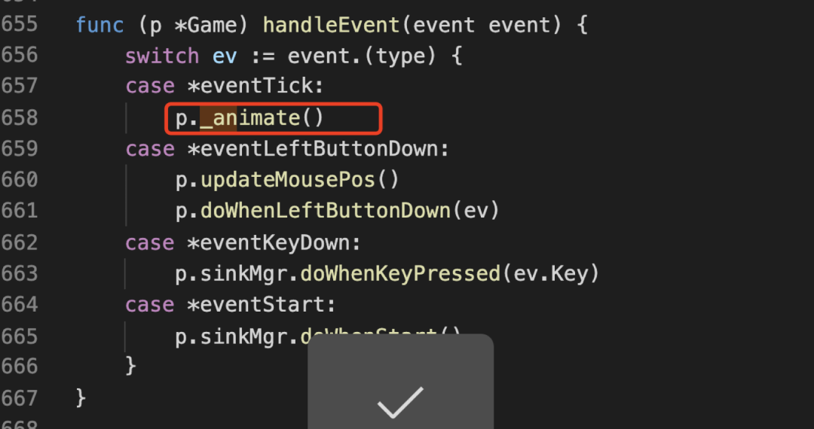
我们会基于时间片来轮询动画时间轴机器。比如每 60 FPS 来调动动画，内部基于时间片来进行计算是否该渲染，如何进行分配。
#### Spx 动画 DEMO 讲解
https://www.bilibili.com/video/BV15L4y1i7kc/?from=search&seid=9636499119487521575&spm_id_from=333.337.0.0